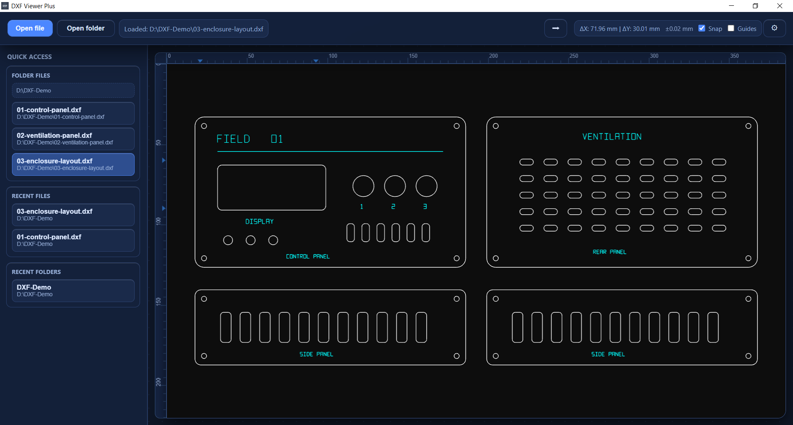
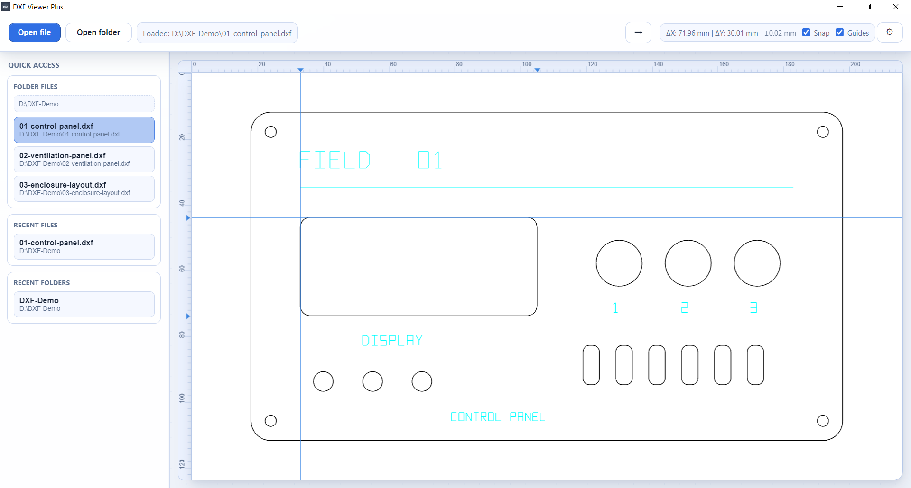

# DXF Viewer

**Open your drawing. Inspect the details. Check the distances.**

A desktop DXF viewer for quick checks at your desk or in the workshop. Pan and zoom around a drawing, use millimetre rulers and draggable measurement guides, and choose a light or dark workspace. Drawing files are opened locally, without uploading them to a service.

**[Download for Windows or Linux](#download)** · [Standard or Plus?](#choose-your-edition) · [Try a sample](#your-first-drawing) · [Get help](#help-and-feedback)

*A real enclosure drawing in Viewer Plus on Windows. [Try the same file](examples/03-enclosure-layout.dxf).*

## Download

Ready-to-use **version 1.2.0** packages are available for 64-bit Windows and Debian/Ubuntu Linux. No development tools are needed.

| Edition | Windows installer | Ubuntu / Debian package |
| --- | --- | --- |
| **DXF Viewer** | [Download .exe](https://github.com/EriArk/-DXF-Viewer/releases/download/v1.2.0/DXF-Viewer-Setup-1.2.0.exe) | [Download .deb](https://github.com/EriArk/-DXF-Viewer/releases/download/v1.2.0/dxf-viewer_1.2.0_amd64.deb) |
| **DXF Viewer Plus** | [Download .exe](https://github.com/EriArk/-DXF-Viewer/releases/download/v1.2.0/DXF-Viewer-Plus-Setup-1.2.0.exe) | [Download .deb](https://github.com/EriArk/-DXF-Viewer/releases/download/v1.2.0/dxf-viewer-plus_1.2.0_amd64.deb) |

Run the Windows installer and follow its steps, or open the Linux package with your system's software installer. For newer versions and release notes, visit **[the releases page](https://github.com/EriArk/-DXF-Viewer/releases/latest)**.

## Choose your edition

Both editions have the same drawing viewer and measurement tools. Choose **Standard** for opening individual drawings, or **Plus** for browsing a folder of parts.

| Feature | Standard | Plus |
| --- | :---: | :---: |
| Open DXF from a file dialog, drag-and-drop or recent files | ✓ | ✓ |
| Pan, zoom and fit the drawing to the window | ✓ | ✓ |
| Millimetre rulers and draggable ΔX / ΔY measurement guides | ✓ | ✓ |
| Optional guide snapping to geometry | ✓ | ✓ |
| Light / dark theme and adjustable line thickness | ✓ | ✓ |
| Open a folder of DXF files | — | ✓ |
| File sidebar, recent folders and quick switching between parts | — | ✓ |

## Your first drawing

1. Install your preferred edition and open it.
2. Download the [control panel sample](https://raw.githubusercontent.com/EriArk/-DXF-Viewer/main/examples/01-control-panel.dxf), then use **Open file** or drag the DXF into the window.
3. Press **Ctrl+F** to fit the drawing. Zoom in to inspect openings and small details.
4. Use the ruler guides to compare horizontal and vertical distances; enable snapping when you want a guide to follow geometry.

In **Plus**, choose **Open folder** to browse a set of parts from the sidebar. The [sample folder](examples) contains a control panel, a ventilation panel and a complete enclosure layout, all in millimetres and free to reuse.

*Both screenshots show Plus. Standard has the same canvas and measuring tools; folder browsing is exclusive to Plus. [Capture details](screenshots/showcase-2026-10/README.md).*

## Useful shortcuts

| Action | Shortcut |
| --- | --- |
| Open a drawing | Ctrl+O |
| Open a folder (Plus) | Ctrl+Shift+O |
| Fit drawing to the window | Ctrl+F |
| Show / hide rulers | Ctrl+R |
| Switch light / dark theme | Ctrl+T |
| Adjust line thickness | Ctrl+= / Ctrl+- |
| Open settings | Ctrl+, |
| Open help | F1 |

## Need to edit the drawing?

Viewer is for viewing and measuring. To draw new parts, edit geometry, add joints or export DXF/SVG, use **[DXF Sketcher](https://github.com/EriArk/-DXF-Sketcher)**.

## Help and feedback

Press **F1** for built-in help, or [report a bug / suggest an improvement](https://github.com/EriArk/-DXF-Viewer/issues). Include your operating system, edition and app version; a small DXF you can share publicly helps reproduce rendering issues.

## For developers

[Run from source and build Standard or Plus packages](docs/BUILDING.md).

## Acknowledgements and license

Special thanks to **Artyom Lebedev**, creator of [dxf-viewer](https://github.com/vagran/dxf-viewer), which powers the app's DXF rendering.

DXF Viewer is licensed under **[MIT](LICENSE)**.
